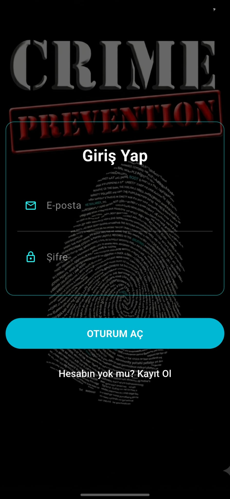
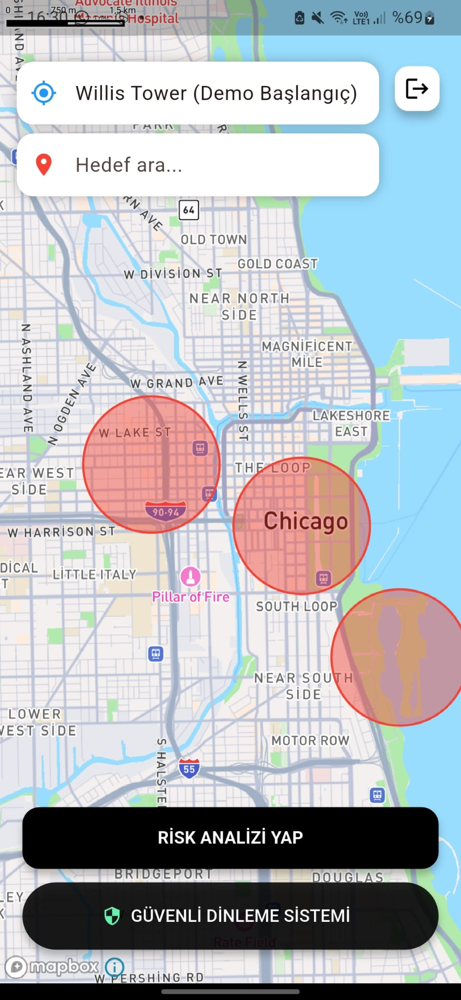
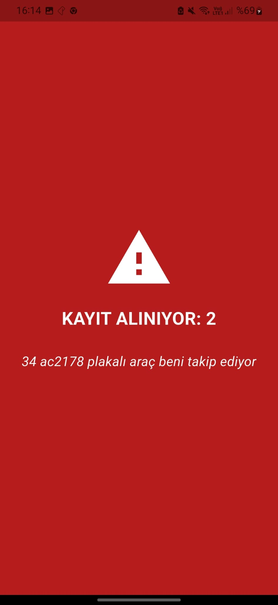

# 🗺️ Chicago SafeRoute AI: Smart Urban Navigation

An AI-driven mobile safety ecosystem designed to provide secure routing and real-time emergency response for urban environments. This project integrates predictive crime modeling with an interactive mobile interface to enhance citizen safety in Chicago.

> **⚠️ Note:** This project is currently under **Patent Pending** and is a **Private Source** repository. This README serves as a technical showcase of its architecture and capabilities.

## 🚀 Key Features
- **AI-Driven Safe Routing:** Calculates the safest paths between locations by analyzing historical crime data using a Flask-based machine learning API.
- **Voice-Activated Emergency Protocol:** A specialized "Safe Word" system that triggers 10-second audio transcription and location logging upon voice detection.
- **Real-Time Risk Mapping:** Visualizes crime density and risk levels across Chicago neighborhoods using interactive heatmaps.
- **Secure Authentication:** Robust user management system integrated with Firebase Auth for personalized safety data tracking.
- **Dynamic UI States:** The interface provides immediate visual feedback (Green for Safe, Red for Emergency Mode).

## 🏗️ System Architecture
The system follows a modern decoupled architecture:
1. **Frontend:** Cross-platform mobile application built with **Flutter**.
2. **Backend:** RESTful API developed with **Flask (Python)** to serve ML model predictions.
3. **Database & Auth:** **Firebase** for real-time data synchronization and user identity management.
4. **ML Model:** Trained on Chicago Open Data to predict regional risk factors.

## 📸 Interface & Workflow
The application prioritizes a minimalist and high-contrast UI for quick interaction during stressful situations.

| 🛡️ Login & Auth | 🗺️ Safe Routing | 🚨 Emergency State |
| :---: | :---: | :---: |
|  |  |  |

## 🎓 Academic Context
This project was developed as a **Thesis Project (Tez)** and submitted for **TÜBİTAK** evaluation. It focuses on the practical application of machine learning in social safety and urban planning.

---
**Developed by Hazan** - *Computer Engineering Student*
*Focus: AI Integration & Mobile Systems*
